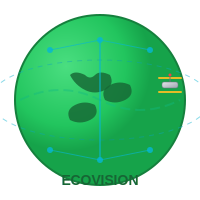

# 🌍 EcoVision: Semantic Change Sentinel

<div align="center">



**AI-Powered Satellite Change Detection for Environmental Monitoring**

[](https://www.python.org/)
[](https://pytorch.org/)
[](LICENSE)
[](#)

*Transforming satellite imagery into actionable environmental insights*

[🚀 Live Demo](#) | [📖 Documentation](#) | [🎯 Results](#results)

</div>

---

## 🎯 **Mission**

EcoVision empowers environmental stakeholders with **real-time, AI-driven change detection** from satellite imagery. Going beyond simple pixel differences, our system provides semantic understanding of environmental changes like deforestation and urban sprawl, complete with sustainability impact assessments.

## 🔥 **Key Features**

- **🛰️ Satellite Imagery Analysis**: Processes Sentinel-2 image pairs with advanced computer vision
- **🤖 Attention-Augmented AI**: State-of-the-art transformer-based architecture with attention gates
- **📊 Impact Quantification**: IPCC-based CO₂ emission calculations for detected changes
- **🎨 Interactive Visualizations**: Heatmaps, overlays, and comprehensive dashboards
- **⚡ Edge-Deployable**: Runs on standard laptops without cloud dependencies
- **🔍 Interpretable**: Grad-CAM explanations for model decisions

## 🏆 **Performance Highlights**

<div align="center">

| Metric | Validation | Test Set |
|--------|------------|----------|
| **IoU** | **0.4782** | 0.3228 |
| **F1-Score** | 0.4857 | 0.4857 |
| **Precision** | 0.6854 | 0.6854 |
| **Recall** | 0.3767 | 0.3767 |

*Achieved with ResNet34 backbone + Transformer fusion on OSCD dataset*

</div>

## 🏗️ **Architecture Overview**

### Core AI Model: Attention-Augmented Change Detector

Our hackathon-ready implementation features a sophisticated **Siamese Transformer Network**:

```python
AttentionChangeDetector(
  ├── ResNet34 Encoder (Pretrained)
  ├── TransformerFusion (256-dim, 8-heads, 4-layers)
  ├── Attention-Gated UNet Decoder
  │   ├── Skip Connections with Attention Gates
  │   ├── Multi-scale Feature Fusion
  │   └── Progressive Upsampling
  └── Binary Change Mask Output
)
```

### Key Technical Innovations

- **🔬 Dual-Stream Architecture**: Separate encoders for before/after images
- **🎯 Attention Gates**: Focus decoder on relevant features, suppress noise
- **🔄 Transformer Fusion**: Cross-attention mechanism for temporal comparison
- **📈 Advanced Augmentation**: Photometric + geometric transformations
- **⚖️ Loss Optimization**: Focal + Dice + BCE loss combination

## 🚀 **Quick Start**

### Prerequisites
```bash
Python 3.10+
PyTorch 2.1+
CUDA-compatible GPU (recommended)
```

### Installation
```bash
# Clone the repository
git clone https://github.com/yourusername/ecovision.git
cd ecovision

# Install dependencies
pip install -r requirements.txt

# For GPU support
pip install torch torchvision torchaudio --index-url https://download.pytorch.org/whl/cu118
```

### Training the Model
```bash
# Run the complete training pipeline
python model.py
```

### Web Application
```bash
# Launch the Streamlit app
streamlit run app/main.py
```

## 📊 **Results & Visualizations**

### Training Performance
<div align="center">

</div>

### Sample Predictions
<div align="center">

</div>

**The model successfully detects:**
- ✅ Forest fragmentation and deforestation
- ✅ Urban expansion patterns
- ✅ Agricultural land changes
- ✅ Infrastructure development

## 🔬 **Technical Deep Dive**

### Model Architecture Details

```python
class AttentionChangeDetector(nn.Module):
    def __init__(self, config):
        super().__init__()
        # Pretrained ResNet34 backbone
        self.encoder = ResNetEncoder("resnet34", pretrained=True)

        # Transformer-based feature fusion
        self.fusion = TransformerFusion(
            dim=256, num_heads=8, num_layers=4
        )

        # Attention-gated decoder
        self.decoder = nn.Sequential(
            DecoderBlock(256, enc_channels[3], 128),  # Attention gates here
            DecoderBlock(128, enc_channels[2], 64),
            DecoderBlock(64, enc_channels[1], 32),
            DecoderBlock(32, enc_channels[0], 16)
        )

        self.final_conv = nn.Conv2d(16, 1, kernel_size=1)
```

### Training Configuration
- **Batch Size**: 16 patches (256×256)
- **Optimizer**: AdamW (lr=1e-4, weight_decay=1e-4)
- **Scheduler**: CosineAnnealingLR
- **Loss**: 0.3*BCE + 0.4*Dice + 0.3*Focal
- **Augmentation**: Color jitter, sharpness, flips

## 🌱 **Environmental Impact**

Beyond detection, EcoVision quantifies sustainability metrics:

- **Area Calculation**: Precise hectare measurements of changes
- **CO₂ Estimation**: IPCC-based carbon sequestration loss calculations
- **Impact Dashboard**: Visual reports for stakeholders
- **Actionable Insights**: Data-driven environmental decision making

## 🎯 **Use Cases**

- **🌳 Conservation NGOs**: Monitor deforestation in protected areas
- **🏛️ Government Agencies**: Track urban sprawl and land use changes
- **🔬 Researchers**: Study environmental patterns over time
- **🏢 Corporations**: Assess environmental impact of development projects

## 🛠️ **Development Roadmap**

### Phase 1 ✅ **Machine Learning Model**
- [x] Attention-augmented architecture
- [x] Transformer-based fusion
- [x] Comprehensive evaluation pipeline

### Phase 2 🚧 **Web Application**
- [x] Streamlit-based interface
- [ ] Model integration
- [ ] Interactive visualizations
- [ ] Impact calculations

### Phase 3 📋 **Future Enhancements**
- [ ] Multi-class semantic segmentation
- [ ] Real-time satellite data integration
- [ ] Mobile deployment
- [ ] API endpoints

## 📚 **Dataset & Training**

**Dataset**: Onera Satellite Change Detection (OSCD)
- **Images**: Sentinel-2 multispectral pairs
- **Cities**: 24 locations worldwide
- **Resolution**: 10m spatial resolution
- **Bands**: RGB (B04, B03, B02)
- **Size**: 1,906 image pairs

**Training Details**:
- Patch-based training (256×256 patches)
- Balanced sampling (change:no-change = 1:1)
- Early stopping with patience=15
- GPU-optimized with mixed precision

## 🤝 **Contributing**

We welcome contributions! This is a hackathon project focused on environmental impact.

1. Fork the repository
2. Create a feature branch
3. Commit your changes
4. Push to the branch
5. Open a Pull Request

## 📄 **License**

This project is licensed under the MIT License - see the [LICENSE](LICENSE) file for details.

## 🙏 **Acknowledgements**

- **Data**: Onera Satellite Change Detection dataset
- **Framework**: PyTorch ecosystem
- **Research**: Based on transformer architectures and attention mechanisms
- **Standards**: IPCC guidelines for carbon calculations

## 📞 **Contact**

**Project Lead**: [Your Name]
**Email**: your.email@example.com
**LinkedIn**: [Your LinkedIn]

---

<div align="center">

**Made with ❤️ for environmental sustainability**

⭐ Star this repo if you find it useful!

[Back to Top](#ecovision-semantic-change-sentinel)

</div>
